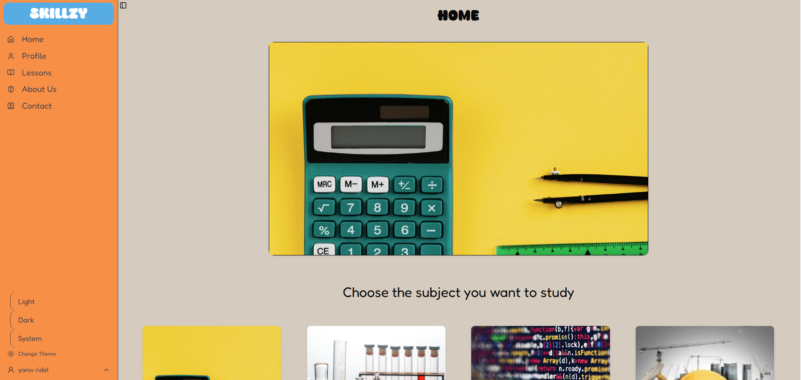
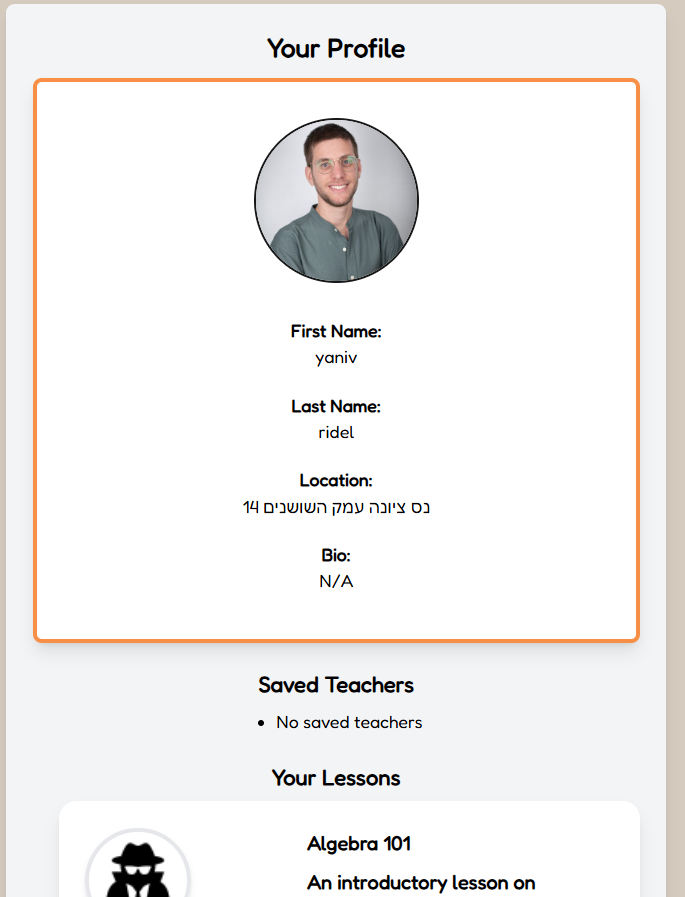
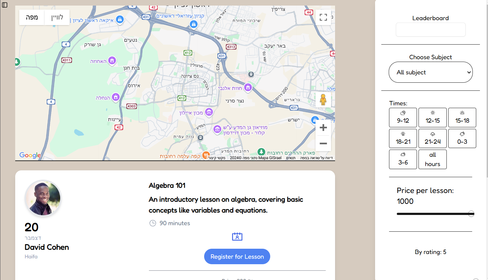
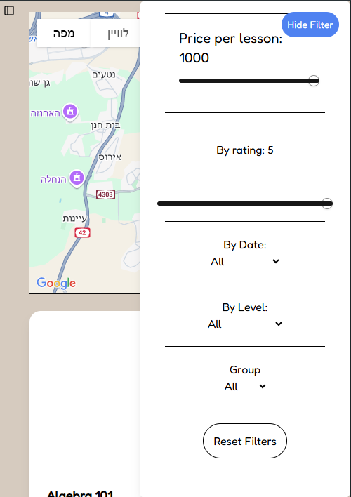
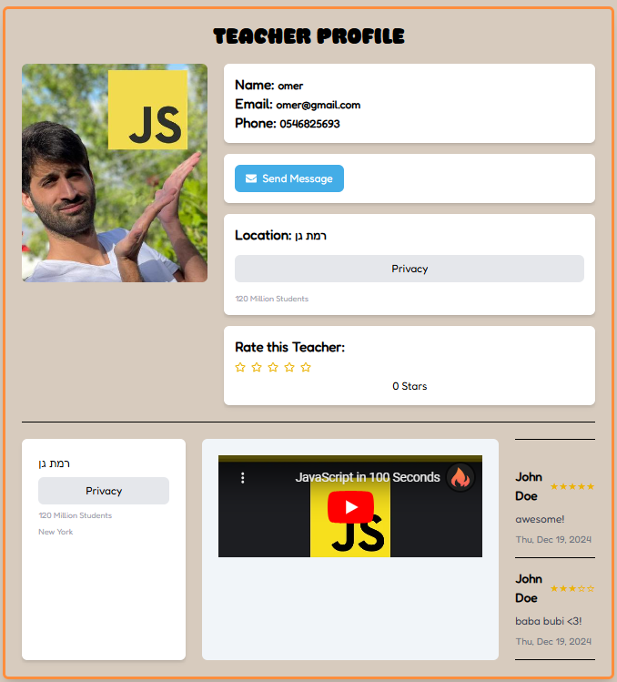

# Skillzy

## Overview

**Skillzy** is a full-stack web application built during a 24-hour hackathon. The platform connects teachers and students, enabling teachers to publish lessons, while students can search for and access those lessons.

This project was developed by a team of four individuals, each contributing to different parts of the application, including frontend, backend, and database management.

## Features

- **Teacher Portal**: Allows teachers to create and publish lessons.
- **Student Portal**: Allows students to search, view, and interact with lessons.
- **Responsive Design**: Built with a mobile-first approach to ensure usability across devices.

## Technologies Used

- **Frontend**: React, Tailwind CSS
- **Backend**: Node.js, Express.js
- **Database**: MongoDB (via Mongoose)
- **Styling**: Tailwind CSS

<table style="width:100%; border-collapse:collapse;">
  <tr>
    <td style="text-align:center;">
        
    </td>
    <td style="text-align:center;">
        
    </td>
  </tr>
    <tr>
    <td style="text-align:center;">
      
    </td>
    <td style="text-align:center;">
        
    </td>
  </tr>
    <tr>
    <td style="text-align:center;">
      
    </td>
    <td style="text-align:center;">
        
    </td>
  </tr>
</table>

## Contributors
- Sasha T
- Maor Shmueli
- Tal Calderon
- [Yaniv Ridel](https://github.com/Yanivridel)
